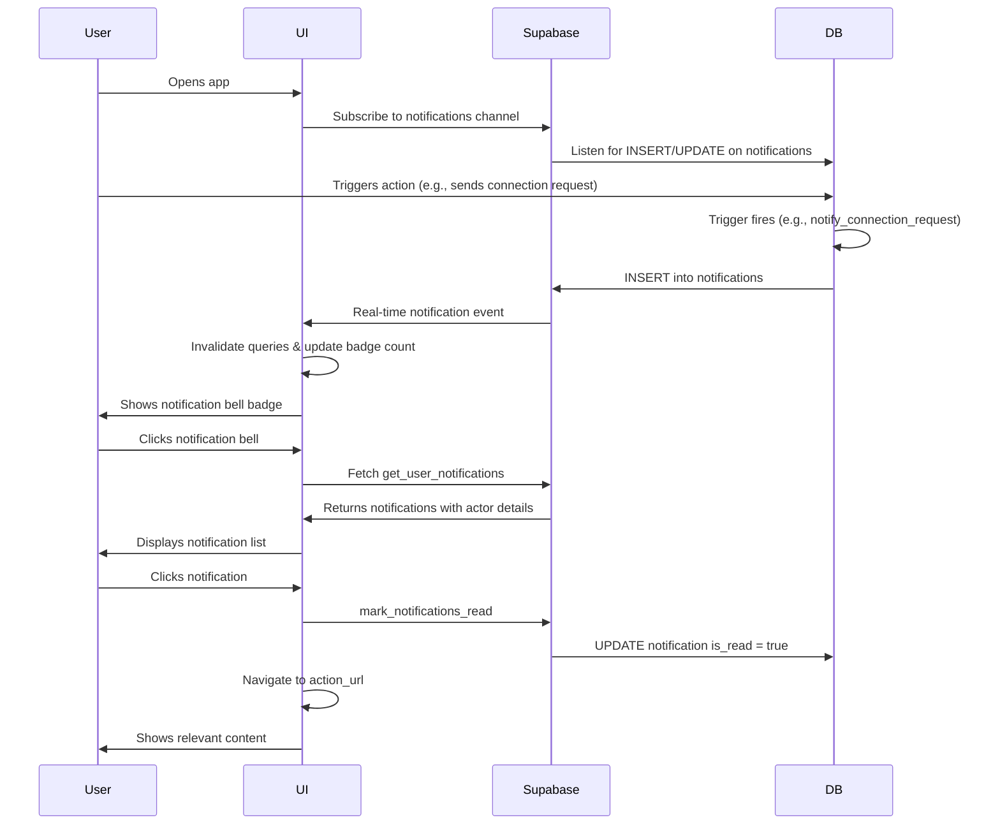

# Phase 5: In-App Notification System

## Overview
Comprehensive real-time notification system that keeps users informed of all important platform activities including connections, messages, profile views, and engagement.

## Implemented Features

### 1. **Real-Time Notification System**
- WebSocket subscriptions for instant notification delivery
- Automatic query invalidation on new notifications
- Real-time unread count updates
- No page refresh needed

### 2. **Notification Bell UI**
- Bell icon in navigation header
- Unread count badge (shows "99+" for 99+)
- Visual indicator when notifications are present
- Popover dropdown for quick access

### 3. **Notification Dropdown**
- Clean, scrollable list of recent notifications (up to 10)
- "Mark all as read" functionality
- Settings shortcut
- "View All Notifications" link
- Empty state with helpful messaging

### 4. **Notification Types Supported**
- `connection_request` - New connection requests
- `connection_accepted` - Connection accepted
- `new_message` - New messages from connected members
- `profile_view` - First-time profile viewers (optional)
- `post_like` - Post engagement
- `post_comment` - Comments on posts
- `event_invite` - Event invitations
- `group_invite` - Group invitations
- `system` - Platform announcements

### 5. **Smart Notification Management**
- Auto-mark as read on click
- Navigate to relevant content on click
- Prevent self-notifications (user can't notify themselves)
- First-view-only notifications for profile views (reduces noise)

### 6. **Notification Item Features**
- Actor avatar and name
- Context-aware icons per notification type
- Time ago display (e.g., "2 hours ago")
- Unread indicator dot
- Visual distinction for unread (bold text, highlighted background)

## Database Schema

### Notifications Table
```sql
notifications
  - id (UUID, PK)
  - user_id (UUID) - Recipient
  - type (TEXT) - Notification type
  - title (TEXT) - Notification title
  - message (TEXT) - Notification message
  - link_url (TEXT) - Action URL to navigate to
  - is_read (BOOLEAN) - Read status
  - read (BOOLEAN) - Legacy read field
  - payload (JSONB) - Actor and entity metadata
  - created_at (TIMESTAMP)
  - updated_at (TIMESTAMP)
```

### RLS Policies
```sql
-- Users can only see their own notifications
CREATE POLICY "Users can view own notifications"
  ON notifications FOR SELECT
  USING (auth.uid() = user_id);

-- Users can update their own notifications (mark as read)
CREATE POLICY "Users can update own notifications"
  ON notifications FOR UPDATE
  USING (auth.uid() = user_id);
```

## RPC Functions

### `get_user_notifications(p_user_id, p_unread_only, p_limit, p_offset)`
Fetches notifications with actor profile details (avatar, name, username).

**Returns:**
- notification_id, actor details, type, title, message
- action_url, is_read, created_at, read_at

### `get_unread_notification_count(p_user_id)`
Returns count of unread notifications for badge display.

### `mark_notifications_read(p_user_id, p_notification_ids[])`
Marks specific notifications as read.

### `mark_all_notifications_read(p_user_id)`
Marks all user notifications as read.

### `create_notification(...)`
Helper function to create notifications from triggers.
- Prevents self-notifications
- Stores actor_id in payload for profile lookup
- Returns notification ID

## Database Triggers

### Connection Notifications
```sql
-- notify_connection_request: New connection request
-- notify_connection_accepted: Connection accepted
```

### Message Notifications
```sql
-- notify_new_message: New message received
```

### Profile View Notifications
```sql
-- notify_profile_view: First-time profile view
-- Only fires once per viewer to prevent spam
```

### Post Engagement Notifications
```sql
-- notify_post_like: Post liked
-- notify_post_comment: New comment on post
```

### Event Notifications
```sql
-- notify_event_invite: Event invitation
-- notify_event_rsvp: RSVP to organizer's event
```

### Group Notifications
```sql
-- notify_new_join_request: New group join request (to admins)
-- notify_join_request_approved: Join request approved
```

## Technical Implementation

### Frontend Components
```
src/components/notifications/
  ├── NotificationBell.tsx      - Bell icon with badge
  ├── NotificationList.tsx      - Dropdown notification list
  ├── NotificationItem.tsx      - Individual notification card
  └── BadgeToastListener.tsx    - Badge-related toasts
```

### Hooks
```
src/hooks/
  ├── useNotifications.ts              - Fetch & manage notifications
  └── useUnreadNotificationCount.ts   - Real-time unread count
```

### Types
```typescript
// src/types/notifications.ts
interface Notification {
  notification_id: string;
  actor_id?: string;
  actor_username?: string;
  actor_full_name?: string;
  actor_avatar_url?: string;
  type: NotificationType;
  title: string;
  message: string;
  action_url?: string;
  is_read: boolean;
  created_at: string;
}
```

## Real-Time Subscription Flow



## Navigation Integration

### UnifiedHeader
- Bell icon integrated in header (right side)
- Visible only to authenticated users
- Real-time unread count badge
- Mobile-responsive

### Notification Pages
- `/dna/notifications` - Full notification list page
- `/dna/settings/notifications` - Notification preferences (future)

## Performance Optimizations

1. **Efficient Queries**
   - Indexed queries on user_id and is_read
   - Limit dropdown to 10 most recent
   - Pagination support for full page

2. **Smart Refetching**
   - 30-second polling interval for unread count
   - Real-time updates via WebSocket
   - Query invalidation on mutations

3. **Reduced Notification Spam**
   - First-view-only for profile views
   - Self-notification prevention
   - Debounced UI updates

## User Experience Features

### Visual Indicators
- 🔴 Red badge for unread count
- 🔵 Blue dot next to unread notifications
- 📱 Bold text for unread items
- 🎨 Subtle background highlight for unread

### Interaction Patterns
- Click notification → Mark as read + Navigate
- Click "Mark all as read" → Batch update
- Click "View All" → Navigate to full page
- Click settings → Notification preferences

### Empty States
- Friendly messaging when no notifications
- Bell icon illustration
- Helpful hints for new users

## Security Considerations

1. **Row-Level Security (RLS)**
   - Users can only see their own notifications
   - Users can only update their own notifications
   - No cross-user data access

2. **Function Security**
   - All RPC functions use SECURITY DEFINER
   - SET search_path = public for safety
   - User ID validation in all functions

3. **Payload Security**
   - JSONB payload stores minimal data (IDs only)
   - Sensitive data fetched from profiles table
   - No PII in notification payload

## Future Enhancements

### Notification Preferences
- Granular notification controls per type
- Email notification settings
- Digest frequency (daily, weekly)
- Do Not Disturb mode

### Advanced Features
- Notification grouping (e.g., "John and 5 others liked your post")
- Notification sounds/vibrations
- Desktop push notifications
- Email digests

### Analytics
- Notification delivery metrics
- Click-through rates
- Most engaged notification types
- User notification preferences analytics

## Testing Checklist

- [ ] Connection request creates notification
- [ ] Connection accepted creates notification
- [ ] New message creates notification
- [ ] Profile view creates notification (first-time only)
- [ ] Notification badge updates in real-time
- [ ] Click notification marks as read
- [ ] Click notification navigates correctly
- [ ] "Mark all as read" works
- [ ] No self-notifications created
- [ ] Real-time updates work without refresh
- [ ] Mobile responsive design
- [ ] Empty states display correctly

## Success Metrics

1. **Notification Delivery Rate**: >99% of notifications delivered within 1 second
2. **Click-Through Rate**: >50% of notifications clicked
3. **Mark as Read Rate**: >80% marked as read within 24 hours
4. **User Engagement**: 30% increase in return visits from notifications

## Conclusion

The notification system is now fully operational and integrated throughout the DNA platform. Users receive real-time updates for all important activities, helping them stay engaged and connected with the community.

**Status**: ✅ Complete and Production-Ready
