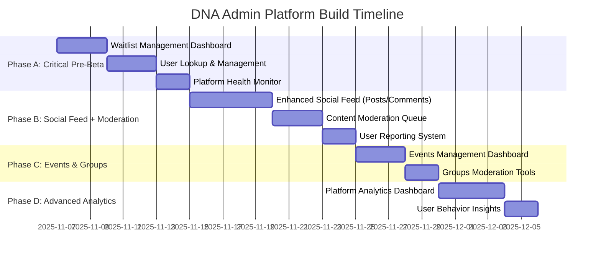

# DNA Admin Platform - Product Requirements Document

**Version:** 1.0  
**Date:** 2025-11-07  
**Status:** Strategy Phase  
**Owner:** DNA Team

---

## Executive Summary

The DNA Admin Platform is the central command center for managing, monitoring, and moderating the Diaspora Network of Africa platform. This PRD outlines a phased approach to building comprehensive admin controls that enable the DNA team to effectively manage user experience, content quality, platform health, and community safety.

**Strategic Approach:** Build incrementally alongside feature development, not as a monolithic afterthought.

---

## Current State Assessment

### ✅ What Exists

#### 1. **Admin Infrastructure** (FOUNDATION SOLID)
- **Role-Based Access Control (RBAC)**
  - `user_roles` table with proper RLS policies
  - `has_role()` security definer function
  - `AdminGuard` component for route protection
  - Admin check via `@diasporanetwork.africa` email domain
  
- **Admin Routes** (`/app/admin`)
  - AdminLayout with navigation
  - AdminDashboard (basic platform stats)
  - EngagementDashboard (ADIN metrics)
  - SignalAnalyticsDashboard (ADIN signals)

#### 2. **ADIN Engagement System** (COMPLETE)
- User engagement tracking table
- ADIN preferences management
- Nudge Center UI
- Connection health signals
- Automated engagement reminders

#### 3. **Database Tables** (100+ tables)
- Comprehensive data models for all features
- RLS policies in place
- Proper foreign key relationships
- Analytics and tracking tables

#### 4. **Existing Admin Components** (PARTIAL/PLACEHOLDER)
- `ContributionModerationQueue` - functional
- `CommunityModeration` - functional
- `InviteSystemOverview` - mock data
- `FeatureTogglesPanel` - functional
- `SeedDataManager` - functional
- `AdinProfileControls` - removed/placeholder

### ⚠️ What's Missing or Incomplete

#### Critical Gaps (Pre-Beta Priority)

1. **Waitlist Management** ❌
   - No admin UI to view/manage `beta_waitlist` table
   - Cannot approve/reject waitlist applications
   - No bulk invite system for beta launch (Dec 1)

2. **User Lookup & Profile Management** ❌
   - Cannot search/view user profiles as admin
   - Cannot edit user details or reset accounts
   - No user activity timeline view
   - Cannot manually verify users or assign roles

3. **Content Moderation** ⚠️ (Partially exists)
   - Community moderation exists
   - **Missing:** Post/comment moderation queue
   - **Missing:** Content flagging review system
   - **Missing:** User reporting system
   - `content_moderation` table exists but no UI

4. **Platform Health Monitoring** ⚠️ (Basic stats only)
   - Basic counts (users, posts, etc.)
   - **Missing:** Real-time activity monitoring
   - **Missing:** Error log viewer
   - **Missing:** Performance metrics
   - **Missing:** Database health checks

#### Important Gaps (Post-Beta Priority)

5. **Social Feed Admin Controls** ❌
   - Cannot feature/pin posts
   - Cannot remove inappropriate content
   - Cannot manage post visibility
   - No bulk actions on posts

6. **Events & Groups Management** ❌
   - Cannot review/approve events
   - Cannot manage group permissions
   - No event analytics for admins

7. **Messaging & Safety** ❌
   - Cannot view reported messages
   - Cannot manage blocked users
   - No abuse pattern detection

8. **Analytics & Insights** ⚠️ (ADIN only)
   - ADIN engagement metrics exist
   - **Missing:** Platform-wide analytics
   - **Missing:** User growth trends
   - **Missing:** Feature adoption metrics
   - **Missing:** Conversion funnels

---

## Strategic Recommendation

### 🎯 **BUILD ADMIN CONTROLS INCREMENTALLY, STARTING NOW**

**Reasoning:**
1. **Pre-Beta Deadline (Dec 1):** Need waitlist management + user onboarding tools ASAP
2. **Social Feed is Critical:** But without moderation tools, we risk launching an unsafe feed
3. **Technical Debt Prevention:** Building admin alongside features is cheaper than retrofitting
4. **Beta Success:** Admins need visibility to respond quickly to issues

### Phased Build Plan



---

## Phase A: Critical Pre-Beta Admin Tools (PRIORITY 1)

### 🎯 Goal: Enable DNA team to manage beta launch effectively

**Timeline:** 8 days  
**Blockers:** None - can start immediately

### Feature 1: Waitlist Management Dashboard

**Database Tables:**
- `beta_waitlist` (exists)

**Admin UI Components:**
1. **Waitlist Queue View**
   - Table showing: name, email, signup date, status, referral source
   - Filters: status (pending/approved/rejected), date range, referral source
   - Search by name/email
   
2. **Bulk Actions**
   - Select multiple applicants
   - Bulk approve → auto-send invite emails
   - Bulk reject with reason
   - Export to CSV
   
3. **Individual Review**
   - View application details
   - See referral information
   - Add admin notes
   - Approve/reject with one click
   
4. **Invite Tracking**
   - View invite status (sent/pending/accepted)
   - Resend invites
   - Set invite expiration

**Routes:**
- `/app/admin/waitlist`

**Success Metrics:**
- Can approve 100 users in < 5 minutes
- Track invite acceptance rate
- Measure time from approval to first login

---

### Feature 2: User Lookup & Management

**Database Tables:**
- `profiles` (exists)
- `auth.users` (exists)
- `user_roles` (exists)
- `user_engagement_tracking` (exists)

**Admin UI Components:**
1. **User Search**
   - Search by: name, email, username, location
   - Advanced filters: role, join date, last active, engagement level
   - Quick preview cards
   
2. **User Profile View (Admin Mode)**
   - All profile fields visible
   - Edit capabilities:
     - Update profile info
     - Change username
     - Verify user manually
     - Assign/remove roles (admin, moderator, verified_contributor)
   - Activity timeline:
     - Login history
     - Posts created
     - Connections made
     - Events attended
   
3. **User Actions**
   - Suspend account (soft delete)
   - Reset password (send email)
   - Force logout
   - Delete account (hard delete with confirmation)
   - Send direct notification
   
4. **Engagement Overview**
   - ADIN profile health score
   - Last active date
   - Engagement signals received/acted on
   - Opt-out status

**Routes:**
- `/app/admin/users`
- `/app/admin/users/:userId`

**Edge Functions Needed:**
- `admin-reset-user-password`
- `admin-send-notification`

---

### Feature 3: Platform Health Monitoring

**Database Tables:**
- `error_logs` (exists)
- Create: `admin_activity_log`

**Admin UI Components:**
1. **Real-Time Dashboard**
   - Active users (last 15 min, 1 hour, 24 hours)
   - Recent signups (last 24h, 7d, 30d)
   - Posts/comments created today
   - Events: upcoming (7d), past (7d)
   - System alerts (errors, failures)
   
2. **Error Log Viewer**
   - Recent errors from `error_logs` table
   - Filter by severity, date, user
   - Stack trace viewer
   - Mark as resolved
   
3. **Database Health**
   - Table sizes
   - Query performance
   - Connection pool status
   - RLS policy violations
   
4. **Feature Usage Stats**
   - Top features by usage
   - Unused features
   - Peak usage times

**Routes:**
- `/app/admin/health`

**Migration Needed:**
```sql
CREATE TABLE admin_activity_log (
  id UUID PRIMARY KEY DEFAULT gen_random_uuid(),
  admin_id UUID REFERENCES auth.users(id) NOT NULL,
  action TEXT NOT NULL,
  entity_type TEXT,
  entity_id UUID,
  details JSONB,
  created_at TIMESTAMPTZ DEFAULT NOW()
);
```

---

## Phase B: Social Feed + Moderation Tools (PRIORITY 2)

### 🎯 Goal: Launch a safe, engaging social feed with proper moderation

**Timeline:** 10 days  
**Dependencies:** Phase A complete

### Feature 4: Enhanced Social Feed (User-Facing)

**What Users Get:**
1. **Rich Post Composer**
   - Text, images, videos, links
   - Polls, events promotion, opportunity sharing
   - Mentions (@username)
   - Hashtags (#topic)
   - Draft saving
   
2. **Feed Algorithms**
   - Following feed (connections only)
   - Discovery feed (trending + recommended)
   - Filter by content type
   - Sort by: newest, trending, most engaged
   
3. **Engagement Features**
   - Like, comment, share, bookmark
   - Reactions (beyond just like)
   - Comment threading
   - Share with note (quote post)
   
4. **Privacy Controls**
   - Post visibility: public, connections only, specific groups
   - Who can comment
   - Mute/block users

**Database Tables (Most Exist):**
- `posts` ✅
- `post_comments` ✅
- `post_likes` ✅
- `post_reactions` ✅
- `post_bookmarks` ✅
- `saved_posts` ✅
- Need: `post_shares`, `post_mentions`, `post_hashtags`

**Routes:**
- `/dna/connect/feed` (exists, needs enhancement)
- `/dna/discover/feed` (exists)

---

### Feature 5: Content Moderation Queue (Admin)

**Database Tables:**
- `content_moderation` (exists)
- `content_flags` (exists)

**Admin UI Components:**
1. **Moderation Queue**
   - All flagged content (posts, comments, messages, profiles)
   - Filter by: flag type, severity, status, date
   - Quick actions: approve, remove, warn user, ban user
   
2. **Review Interface**
   - Full content preview with context
   - Flag details (who flagged, reason, timestamp)
   - User history (past violations)
   - Moderation decision form:
     - Action (approve/remove/escalate)
     - User consequence (none/warning/suspension/ban)
     - Admin notes (internal)
     - User notification (optional message)
   
3. **Auto-Moderation Rules**
   - Keyword blacklist
   - Spam detection triggers
   - Account age restrictions
   - Auto-flag thresholds
   
4. **Moderation Analytics**
   - Flags received per day
   - Resolution time
   - Moderator performance
   - Common violation types

**Routes:**
- `/app/admin/moderation`
- `/app/admin/moderation/:contentId`

**Edge Functions:**
- `content-auto-moderator` (background job)

---

### Feature 6: User Reporting System

**Database Schema:**
```sql
CREATE TABLE user_reports (
  id UUID PRIMARY KEY DEFAULT gen_random_uuid(),
  reporter_id UUID REFERENCES auth.users(id) NOT NULL,
  reported_user_id UUID REFERENCES auth.users(id),
  reported_content_id UUID,
  reported_content_type TEXT CHECK (reported_content_type IN ('post', 'comment', 'message', 'profile', 'event')),
  reason TEXT NOT NULL,
  details TEXT,
  status TEXT DEFAULT 'pending' CHECK (status IN ('pending', 'reviewing', 'resolved', 'dismissed')),
  moderator_id UUID REFERENCES auth.users(id),
  moderator_notes TEXT,
  resolved_at TIMESTAMPTZ,
  created_at TIMESTAMPTZ DEFAULT NOW()
);
```

**User UI:**
- Report button on posts, comments, profiles
- Report reason selection (harassment, spam, hate speech, etc.)
- Optional details field
- Confirmation modal

**Admin UI:**
- View all reports
- Prioritize by severity
- Assign to moderators
- Track resolution

---

## Phase C: Events & Groups Management (PRIORITY 3)

### Feature 7: Events Management Dashboard

**Capabilities:**
- Review new events before publish (if approval required)
- Feature events on platform
- Cancel/remove events
- View event analytics (RSVPs, attendance, engagement)
- Manage event categories/tags

**Routes:**
- `/app/admin/events`

---

### Feature 8: Groups Moderation

**Capabilities:**
- Review new groups
- Manage group categories
- Assign/remove moderators
- View group health metrics
- Handle group reports

**Routes:**
- `/app/admin/groups`

---

## Phase D: Advanced Analytics (PRIORITY 4)

### Feature 9: Platform Analytics Dashboard

**Metrics to Track:**
1. **User Growth**
   - New signups (daily, weekly, monthly)
   - Activation rate (completed onboarding)
   - Retention (D1, D7, D30)
   - Churn rate
   
2. **Engagement**
   - DAU, WAU, MAU
   - Session duration
   - Actions per session
   - Feature usage breakdown
   
3. **Content**
   - Posts/comments per day
   - Top creators
   - Viral content
   - Engagement rates by content type
   
4. **Community Health**
   - Connection growth rate
   - Message volume
   - Event participation
   - Group activity

**Routes:**
- `/app/admin/analytics`

---

## Technical Architecture

### Admin-Only RLS Policies Pattern

```sql
-- Example: Admin can view all posts
CREATE POLICY "Admins can view all posts"
ON posts FOR SELECT
TO authenticated
USING (
  public.has_role(auth.uid(), 'admin') OR
  auth.uid() = user_id
);

-- Example: Admin can update any post
CREATE POLICY "Admins can update any post"
ON posts FOR UPDATE
TO authenticated
USING (public.has_role(auth.uid(), 'admin'))
WITH CHECK (public.has_role(auth.uid(), 'admin'));
```

### Admin Activity Logging

Every admin action must be logged:
```typescript
async function logAdminAction(action: string, details: any) {
  await supabase.from('admin_activity_log').insert({
    admin_id: user.id,
    action,
    entity_type: details.entityType,
    entity_id: details.entityId,
    details: details.context
  });
}
```

---

## Security Considerations

### Role Assignment
- Only super admins can assign admin roles
- Require email verification
- Log all role changes
- Audit trail for 90 days

### Data Access
- Admin actions are logged
- Sensitive data (passwords, tokens) never exposed
- PII access is audited
- GDPR compliance (right to delete)

### Rate Limiting
- Admin endpoints rate-limited
- Prevent bulk data extraction
- Alert on suspicious patterns

---

## Decision Matrix: Admin First vs Social Feed First

| Factor | **Admin First** | **Social Feed First** |
|--------|----------------|----------------------|
| **Beta Launch Readiness** | ✅ Can manage waitlist & users | ⚠️ Limited user management |
| **Safety & Trust** | ✅ Moderation ready | ❌ No moderation tools |
| **User Experience** | ⚠️ Less exciting features | ✅ Engaging social features |
| **Technical Debt** | ✅ Clean foundation | ⚠️ Retrofit moderation later |
| **Team Velocity** | ⚠️ Less visible progress | ✅ Visible feature growth |
| **Risk Mitigation** | ✅ Control & visibility | ⚠️ Reactive to issues |

---

## Final Recommendation

### **HYBRID APPROACH: Phase A → Phase B Together**

**Week 1 (Now):**
- Build Phase A: Critical Admin Tools (waitlist, user lookup, health monitoring)
- This unblocks beta launch prep

**Week 2-3:**
- Build Phase B.1: Enhanced Social Feed (user features)
- **Simultaneously** build Phase B.2: Content Moderation (admin features)
- Launch together = safe social feed from day one

**Week 4+:**
- Phase C & D as needed based on beta feedback

---

## Success Criteria

### Phase A Success:
- ✅ DNA team can approve 500 waitlist users in < 1 hour
- ✅ Can find any user in < 30 seconds
- ✅ Real-time platform health visible at a glance

### Phase B Success:
- ✅ Users posting 10+ times/day on social feed
- ✅ All flagged content reviewed within 24 hours
- ✅ Zero unmoderated harmful content in first 30 days

### Overall Success:
- ✅ Beta launch on Dec 1 with full admin controls
- ✅ Social feed has 70%+ daily engagement rate
- ✅ Zero critical moderation incidents
- ✅ Admin team efficiency: < 2 hours/day on routine tasks

---

## Next Steps

1. **Review this PRD** with DNA team
2. **Confirm prioritization** (Phase A → B → C → D)
3. **Start Phase A immediately** (Waitlist Dashboard)
4. **Design mockups** for admin UI components
5. **Begin build** 🚀

---

**Document Owner:** Makena (AI Co-Founder)  
**Last Updated:** 2025-11-07  
**Status:** Awaiting Jaûne's approval to begin Phase A
