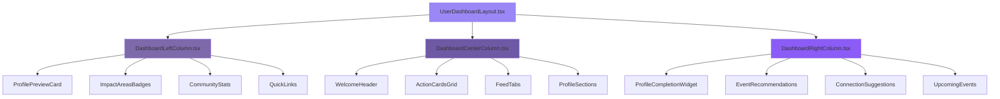
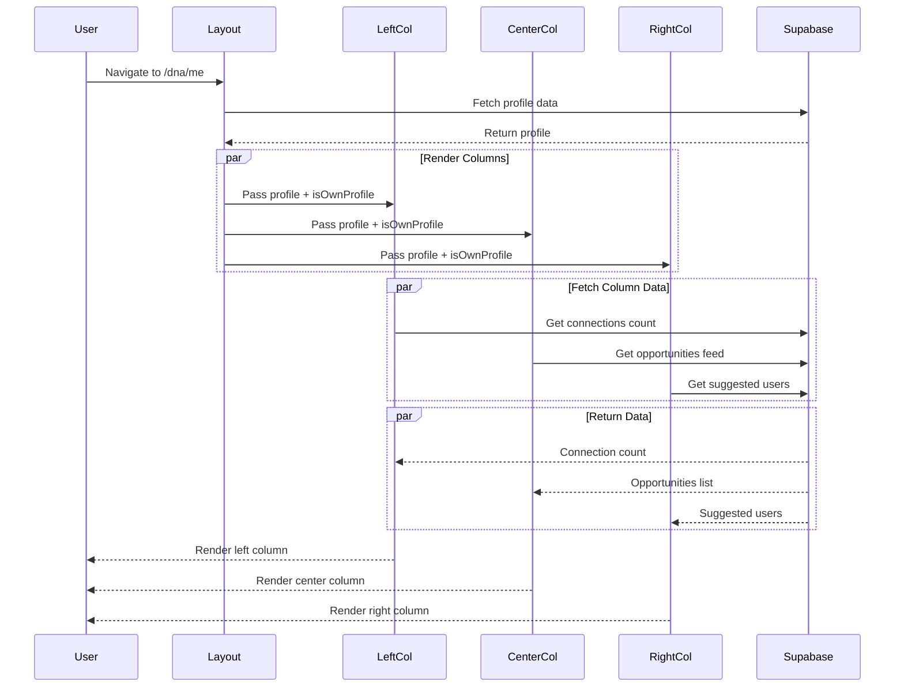

# DNA Dashboard: Team Implementation Guide

> **Status:** ✅ Phase 1 MVE Ready  
> **Last Updated:** 2025-01-10  
> **For:** Engineering & Product Team

---

## 🎯 Executive Summary

The DNA dashboard (`/dna/me`) is our **flagship user experience** - a LinkedIn-inspired 3-column layout that serves as the central hub for African Diaspora professionals to manage their presence, discover opportunities, and grow their network.

**Key Metrics:**
- **Desktop:** 3 independent scrolling columns (25% / 50% / 25%)
- **Mobile:** Single stacked column (Priority: Center → Left → Right)
- **Core Files:** 3 column components + 1 layout orchestrator
- **Status:** Fully functional, ready for MVE launch

---

## 🏗️ Architecture Overview

### Visual Structure

```
┌─────────────────────────────────────────────────────────────────┐
│                    UNIFIED HEADER (Fixed Top)                    │
│         Feed | My DNA | Connect | Network | Events | Etc         │
└─────────────────────────────────────────────────────────────────┘
┌──────────────┬───────────────────────────┬──────────────────────┐
│              │                           │                      │
│  LEFT 25%    │      CENTER 50%           │     RIGHT 25%        │
│              │                           │                      │
│  Profile     │   Main Feed               │   Growth             │
│  Identity    │   Activity                │   Widgets            │
│  Quick Nav   │   Content                 │   Recommendations    │
│              │                           │                      │
│  ↕ Scroll    │    ↕ Scroll              │    ↕ Scroll          │
│  Independent │    Independent            │    Independent       │
│              │                           │                      │
└──────────────┴───────────────────────────┴──────────────────────┘
```

### Component Hierarchy



---

## 📊 Column Responsibilities

### 🔷 LEFT COLUMN: Identity Anchor

**Purpose:** Persistent user context and quick navigation

**Component:** `src/components/dashboard/DashboardLeftColumn.tsx`

**Content Sections:**
1. **Profile Preview Card**
   - Avatar (clickable → stays on `/dna/me`)
   - Full Name
   - Headline/Title
   - Location
   - Edit Profile button (→ `/dna/me/edit`)

2. **Impact Areas** (if defined)
   - Colored badges from `profile.africa_focus_areas`
   - Visual representation of user's focus

3. **Community Stats** (Real-time)
   - 🔗 Connections count (from `connections` table)
   - 📂 Projects count (from `collaboration_memberships`)
   - 👁️ Profile Views (placeholder for future)

4. **Quick Links**
   - Find Connections → `/connect`
   - Network → `/dna/network`
   - Explore Opportunities → `/opportunities`

**Scrolling:** Independent vertical scroll when content exceeds viewport

**Data Dependencies:**
```typescript
// Connection count query
const { data: connectionCount } = useQuery({
  queryKey: ['connection-count', profile.id],
  queryFn: async () => {
    const { count } = await supabase
      .from('connections')
      .select('*', { count: 'exact', head: true })
      .or(`a.eq.${profile.id},b.eq.${profile.id}`)
      .eq('status', 'accepted');
    return count || 0;
  }
});
```

---

### 🔶 CENTER COLUMN: Main Content Hub

**Purpose:** Primary engagement area - feed, opportunities, profile narrative

**Component:** `src/components/dashboard/DashboardCenterColumn.tsx`

**Content Flow (Top → Bottom):**

1. **Welcome Header** (Personalized)
   ```typescript
   // Conditional rendering
   {isOwnProfile ? (
     <>
       Welcome back, {profile.full_name}!
       Connect with African diaspora professionals worldwide
     </>
   ) : (
     <>
       {profile.full_name}
       {profile.headline}
     </>
   )}
   ```
   - Badges: Heritage, Profession, Location
   - Profile completion ring (circular progress)

2. **Action Cards Grid** (2x2)
   ```
   ┌────────────────┬────────────────┐
   │ Discover       │ My Network     │
   │ Professionals  │                │
   ├────────────────┼────────────────┤
   │ Messages       │ People You     │
   │                │ May Know       │
   └────────────────┴────────────────┘
   ```
   **Navigation:**
   - Discover → `/connect`
   - My Network → `/dna/network`
   - Messages → `/messages`
   - People You May Know → Opens inline

3. **Your Feed Tabs**
   - **Opportunities Tab:** Shows feed from `opportunities` table
   - **Following Tab:** Posts from connected users
   - Empty state with call-to-action

4. **Profile Narrative Sections** (if data exists)
   - 📖 About (bio)
   - 🌍 My Diaspora Journey (story)
   - ✨ Skills & Expertise (tags)
   - 🎯 Networking Goals (intentions)
   - 📊 Network Impact (owner only - analytics)

**Scrolling:** Primary scroll area, 2-3 viewport heights expected

**Key Logic:**
```typescript
// Feed data structure (future)
const opportunities = await supabase
  .from('opportunities')
  .select('*')
  .contains('impact_areas', profile.impact_areas) // Match user interests
  .eq('status', 'active')
  .order('created_at', { ascending: false });
```

---

### 🔸 RIGHT COLUMN: Growth Engine

**Purpose:** Drive profile completion, connections, and engagement

**Component:** `src/components/dashboard/DashboardRightColumn.tsx`

**Widget Stack (Top → Bottom):**

1. **Profile Completion Widget** (Owner Only)
   ```typescript
   // Only shows if profile < 100% complete
   {isOwnProfile && profile.profile_completion_percentage < 100 && (
     <ProfileCompletionWidget 
       profile={profile}
       onComplete={() => navigate('/dna/me/edit')}
     />
   )}
   ```
   - Progress bar
   - Missing fields list
   - CTA: "Complete Profile" → `/dna/me/edit`

2. **Event Recommendations** (Owner Only)
   ```typescript
   // Component: EventRecommendationsWidget.tsx
   // Shows 3 upcoming events based on:
   // - User's impact_areas
   // - User's location
   // - Events user is registered for
   ```

3. **People You May Know**
   - Algorithm: Users with similar `impact_areas` and `skills`
   - Excludes existing connections
   - Shows: Avatar, Name, Headline, Connect button
   - Limit: 5 suggestions
   - CTA: "Show more" → `/connect`

4. **Upcoming Events**
   - Shows events user registered for
   - Nearby events based on location
   - Limit: 3 events
   - CTA: "Explore Events" → `/dna/events`

5. **DNA Updates** (Static - future: dynamic)
   - Community news
   - Platform updates
   - Feature announcements

**Scrolling:** Independent vertical, 1-2 viewport heights

**Connection Algorithm:**
```typescript
// Suggested users query
const suggestedUsers = await supabase
  .from('profiles')
  .select('*')
  .contains('impact_areas', currentUser.impact_areas)
  .neq('id', currentUser.id)
  .not('id', 'in', connectionIds) // Exclude existing connections
  .limit(5);
```

---

## 🔄 Navigation & Routing Map

### Internal Navigation (Stays on `/dna/me`)

| Element | Route | Has Back Button? |
|---------|-------|------------------|
| Edit Profile | `/dna/me/edit` | ✅ Yes → `/dna/me` |
| Complete Profile Widget | `/dna/me/edit` | ✅ Yes → `/dna/me` |

### External Navigation (Leaves `/dna/me`)

| Element | Route | Back Button? |
|---------|-------|--------------|
| Find Connections | `/connect` | ❌ Use main nav |
| My Network | `/dna/network` | ❌ Use main nav |
| Messages | `/messages` | ❌ Use main nav |
| Explore Events | `/dna/events` | ❌ Use main nav |
| Opportunities | `/opportunities` | ❌ Use main nav |
| User Profile Click | `/dna/[username]` | ✅ Yes → `navigate(-1)` |
| Event Detail | `/dna/events/[id]` | ✅ Yes → `/dna/events` |

### Navigation Flow Diagram

```mermaid
graph LR
    A[/dna/me Dashboard] --> B[Edit Profile]
    B -->|Back Button| A
    
    A --> C[/connect]
    A --> D[/dna/network]
    A --> E[/messages]
    A --> F[/dna/events]
    A --> G[/opportunities]
    
    C -->|Main Nav| A
    D -->|Main Nav| A
    E -->|Main Nav| A
    F -->|Main Nav| A
    G -->|Main Nav| A
    
    A --> H[User Profile]
    H -->|Back Button| A
    
    style A fill:#9b87f5
    style B fill:#D6BCFA
    style H fill:#D6BCFA
```

---

## 📱 Responsive Behavior

### Desktop (≥1024px)

**Layout:**
```css
.left-column   { width: 25%; }
.center-column { width: 50%; max-width: 800px; }
.right-column  { width: 25%; }
```

**Scrolling:**
- Each column scrolls independently
- Height: `calc(100vh - 4rem)` (minus header)
- Smooth scroll behavior enabled

### Mobile (<1024px)

**Layout:** Single column, stacked

**Order (Priority):**
1. Center Column (Main content)
2. Left Column (Profile context)
3. Right Column (Recommendations)

**Implementation:**
```typescript
// In UserDashboardLayout.tsx
{isMobile ? (
  <div className="space-y-6 py-6 px-4 overflow-y-auto h-full">
    <DashboardCenterColumn />
    <DashboardLeftColumn />
    <DashboardRightColumn />
  </div>
) : (
  // 3-column layout
)}
```

---

## 🎨 Design System Integration

### Color Tokens (from `index.css`)

**CRITICAL:** All colors MUST use semantic tokens, NOT direct colors

```css
/* ❌ WRONG - Direct colors */
<div className="bg-white text-black border-gray-200">

/* ✅ CORRECT - Semantic tokens */
<div className="bg-background text-foreground border-border">
```

### Typography Hierarchy

```typescript
// Headers
<h1 className="text-3xl font-bold text-foreground">
<h2 className="text-2xl font-semibold text-foreground">
<h3 className="text-xl font-medium text-foreground">

// Body text
<p className="text-muted-foreground">
<span className="text-sm text-muted-foreground">

// Interactive elements
<Button variant="default">  // Primary actions
<Button variant="outline">  // Secondary actions
<Button variant="ghost">    // Tertiary actions
```

### Spacing System

```typescript
// Consistent spacing using Tailwind scale
gap-4    // 16px - Between card elements
gap-6    // 24px - Between sections
py-6     // 24px - Vertical padding
px-4     // 16px - Horizontal padding (mobile)
px-6     // 24px - Horizontal padding (desktop)
```

---

## 🔧 Technical Implementation Details

### File Structure

```
src/
├── components/
│   └── dashboard/
│       ├── UserDashboardLayout.tsx      # Main orchestrator
│       ├── DashboardLeftColumn.tsx      # Left column
│       ├── DashboardCenterColumn.tsx    # Center column
│       └── DashboardRightColumn.tsx     # Right column
├── pages/
│   └── dna/
│       └── Me.tsx                       # Route handler
└── hooks/
    └── useMobile.tsx                    # Responsive hook
```

### Key Dependencies

```typescript
// Data fetching
import { useQuery } from '@tanstack/react-query';
import { supabase } from '@/integrations/supabase/client';

// Routing
import { useNavigate } from 'react-router-dom';

// Responsive
import { useMobile } from '@/hooks/useMobile';

// UI Components
import { Button } from '@/components/ui/button';
import { Card } from '@/components/ui/card';
import { Badge } from '@/components/ui/badge';
```

### Data Flow



---

## ⚠️ Known Issues & Fixes

### Issue #1: Duplicate "People You May Know"

**Problem:** Section appears in both Center and Right columns

**Fix:**
```typescript
// In DashboardCenterColumn.tsx - REMOVE THIS
- <Card>People You May Know</Card>

// Keep ONLY in DashboardRightColumn.tsx
✅ <Card>People You May Know</Card>
```

**Status:** ⚠️ To be fixed in next sprint

---

### Issue #2: Empty Event Recommendations

**Problem:** `EventRecommendationsWidget` not yet created

**Fix:** Create widget component

**File:** `src/components/dashboard/EventRecommendationsWidget.tsx`

```typescript
export const EventRecommendationsWidget = ({ profile }) => {
  const { data: events } = useQuery({
    queryKey: ['recommended-events', profile.id],
    queryFn: async () => {
      const { data } = await supabase
        .from('events')
        .select('*')
        .gte('start_time', new Date().toISOString())
        .limit(3);
      return data;
    }
  });

  return (
    <Card>
      <CardHeader>
        <CardTitle>Recommended Events</CardTitle>
      </CardHeader>
      <CardContent>
        {events?.map(event => (
          <EventCard key={event.id} event={event} />
        ))}
      </CardContent>
    </Card>
  );
};
```

**Status:** ⚠️ To be created

---

## 🚀 Implementation Checklist

### Phase 1: MVE Launch Ready ✅

- [x] 3-column layout with independent scrolling
- [x] Profile preview card
- [x] Community stats (connections, projects)
- [x] Quick links navigation
- [x] Welcome header with badges
- [x] Action cards grid
- [x] Feed tabs (Opportunities, Following)
- [x] Profile narrative sections
- [x] Profile completion widget
- [x] People You May Know widget
- [x] Responsive mobile layout
- [x] Back buttons on detail pages
- [x] "Events" in main navigation

### Phase 2: Post-Launch Enhancements ⏳

- [ ] Remove duplicate "People You May Know" from center
- [ ] Create `EventRecommendationsWidget`
- [ ] Wire up opportunities feed data
- [ ] Implement connection recommendation algorithm
- [ ] Add profile views analytics
- [ ] Add breadcrumb navigation
- [ ] Optimize mobile bottom tab bar
- [ ] Add quick actions floating button
- [ ] Implement real-time updates

---

## 🧪 Testing Scenarios

### Test Case 1: Column Scrolling

**Steps:**
1. Navigate to `/dna/me`
2. Scroll left column → Verify independent scroll
3. Scroll center column → Verify independent scroll
4. Scroll right column → Verify independent scroll
5. Verify other columns remain stationary

**Expected:** Each column scrolls independently without affecting others

---

### Test Case 2: Navigation Flow

**Steps:**
1. Click "Edit Profile" → Should go to `/dna/me/edit`
2. Click "Back to Profile" → Should return to `/dna/me`
3. Click "Find Connections" → Should go to `/connect`
4. Use main nav "My DNA" → Should return to `/dna/me`

**Expected:** All navigation paths work correctly with proper back buttons

---

### Test Case 3: Responsive Layout

**Steps:**
1. View dashboard on desktop (>1024px)
2. Verify 3 columns side-by-side
3. Resize to mobile (<1024px)
4. Verify single column stack: Center → Left → Right

**Expected:** Layout adapts smoothly to screen size

---

### Test Case 4: Data Loading

**Steps:**
1. Navigate to `/dna/me` (fresh load)
2. Observe connection count loading
3. Observe suggested users loading
4. Verify loading states display

**Expected:** Graceful loading with skeleton states

---

## 📞 Support & Questions

### For Engineering Questions:
- **File Location:** `src/components/dashboard/`
- **Database Schema:** See `docs/DATABASE_SCHEMA.md`
- **API Queries:** See individual component files

### For Design Questions:
- **Design System:** See `src/index.css` and `tailwind.config.ts`
- **Component Library:** shadcn/ui components in `src/components/ui/`

### For Product Questions:
- **User Stories:** See product backlog
- **Analytics:** See `/dna/analytics` (admin only)

---

## 🎯 Success Metrics (Post-Launch)

**User Engagement:**
- Time spent on dashboard page
- Click-through rate on action cards
- Profile completion rate

**Technical Performance:**
- Page load time < 2 seconds
- Time to interactive < 3 seconds
- Zero scroll jank (60fps)

**User Satisfaction:**
- Net Promoter Score (NPS) > 40
- User feedback on navigation clarity
- Support ticket volume

---

## 📚 Additional Resources

- [Full Architecture Doc](./DASHBOARD_ARCHITECTURE.md)
- [Database Schema](./DATABASE_SCHEMA.md)
- [Component Storybook](#) (to be created)
- [Design Figma](#) (to be linked)

---

**Document Prepared By:** Makena (AI Co-Founder)  
**For:** DNA Engineering & Product Team  
**Version:** 1.0 MVE  
**Next Review:** Post-MVE Launch (February 2025)
